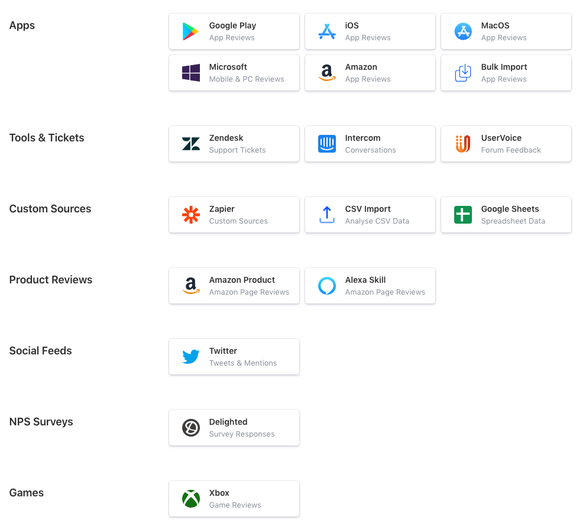
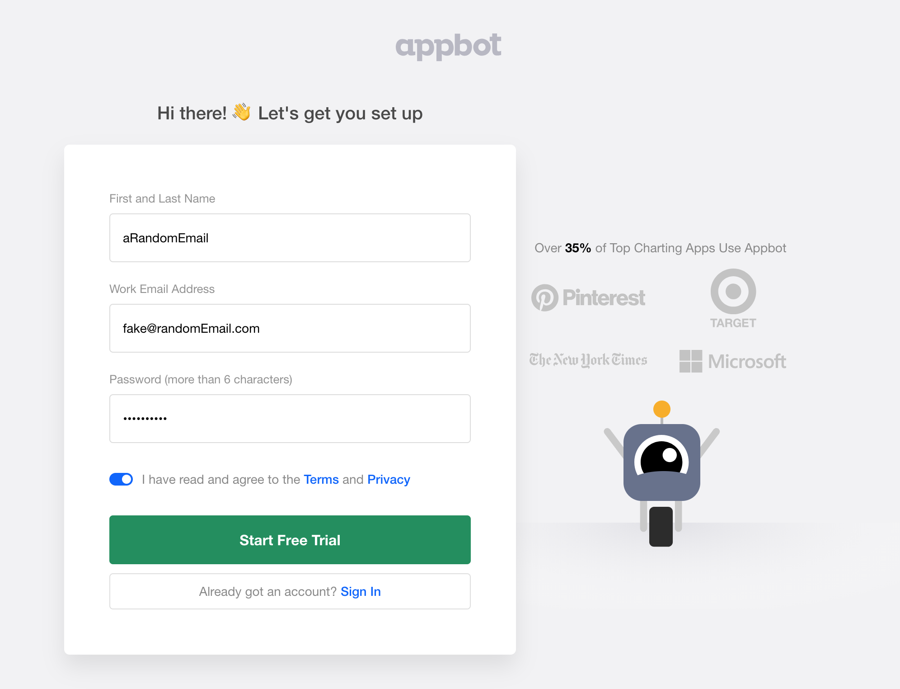
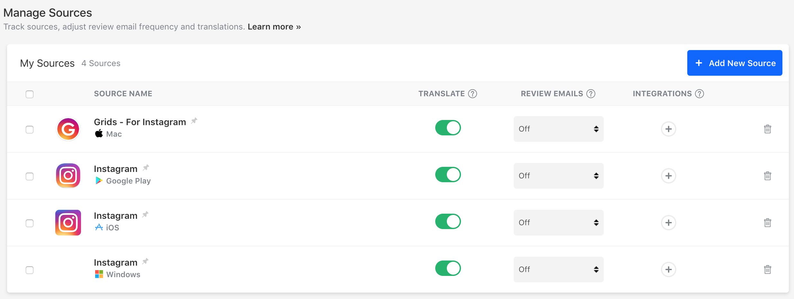
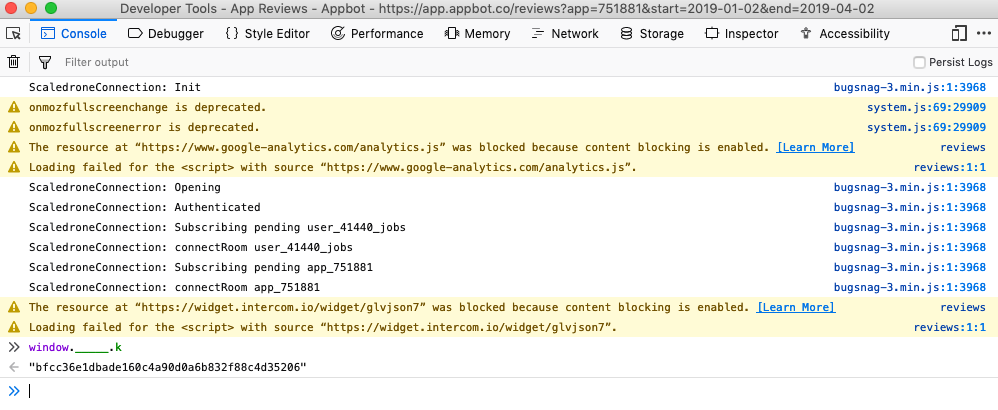
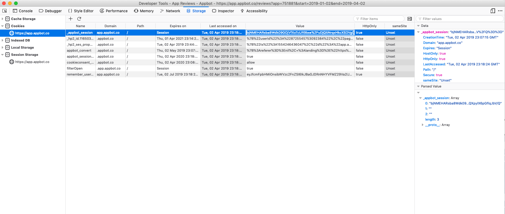
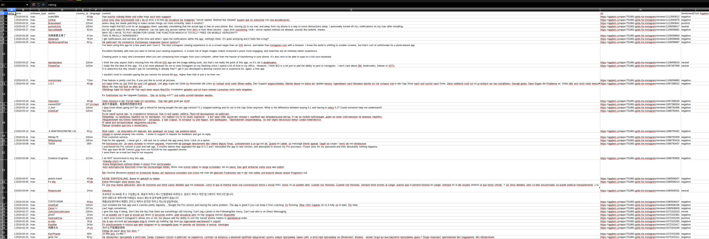

# AppbotCrawler
### 黑吃黑，爬爬虫网站的爬虫

# Supported plantforms:

## Usage:

### 1.

Go to https://app.appbot.co/users/sign_up and register an account using a fake email (no email verification needed)

### 2.

Add your app

### 3.

Go to the review page of your app

`<url>`: set the data date range filter on the website, then copy the url like this:

`https://app.appbot.co/reviews?app=751881&start=2019-01-02&end=2019-04-02`

`<Key>`: Rightclick the browser->Open the console of the browser, input document.cookie to get the cookie and window._____.k to get the key:

`<_appbot_session>`: Storage->cookies->app.appbot.co->_appbot_session->copy the value

### 4.

run

`python appbot.py <_appbot_session> <Key> <Url>`

### 5.

The json file will be downloaded, to convert the json file into csv, run:

`python json2csv.py <filename>`

### 6.

result:

### 7. **Give me a star if you like it 😃 **
